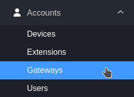

# Gateways

Gateways define the location and settings for other VoIP servers or
Providers. After defining the Gateways use the Outbound routes to direct
calls through the gateways. Required items are in bold. Its a good idea
to start with the required items test it and then make adjustments as
needed.

Gateways provide access into other voice networks. These can be voice
providers or other systems that require SIP registration. [Check out the
Youtube video](https://youtu.be/YKOTACDYQ3A) .

<iframe width="100%" height="350" src="https://www.youtube.com/embed/YKOTACDYQ3A?rel=0" frameborder="0" ; encrypted-media" allowfullscreen></iframe>

**In this example we will be using** [VoiceTel](http://tiny.cc/voicetel)
. **Each Gateway provider has their own setings to use.**

[Click to visit](http://tiny.cc/voicetel)

Select **Accounts** from the drop-down list and click on **Gateways**.

Click the **ADD** button on the right. Enter the gateway information
below and Click on **Save** once complete.

    Gateway: VoiceTel 
    Username: 0123456789 
    Password: 1b3d5f7h9j 
    From user: 0123456789 
    From domain: sbc.voicetel.com 
    Proxy: sbc.voicetel.com 
    Register: true 
    Enabled: true 

| 

## Basic Settings

-   **Gateway:** The name of the Gateway. The company name or domain
    name of th VoIP provider is commonly used for the name.
-   **Username:** This is the username for SIP registration provided by
    the carrier.
-   **Password:** This is the password for SIP registrations it is
    provided by the carrier.
-   **From User:** Optional: Set a specific SIP From User
-   **From Domain:** Optional: Sets a specific SIP From Domain.
-   **Proxy:** Required: Proxy server address used by the carrier. This
    will vary by carrier.
-   **Realm:** Optional: Required by some carriers
-   **Expire Seconds:** Optional: The time until the registration with
    carrier expires.
-   **Register:** Required: Set to **true** if the carrier uses a
    username and password. Set to **false** if the carrier uses IP
    authentication. If false, you will need to specify all of the
    carrier IP\'s in the **Advanced \> Access Controls.**
-   **Context:** Required: Default is set to public and usually the
    correct value.
-   **Profile:** Required: The SIP profile used by default external is
    used. If you disable the external profile make sure to change the
    SIP profile to one that is enabled.
-   **Hostname:** This should usually be left empty. When the hostname
    is set the gateway will only start on the matching server with same
    hostname. If the hostname is left blank the gateway will start
    regardless of the server\'s hostname.
-   **Enabled:** Required: If the gateway is enabled or disabled.
-   **Description:** It is helpful to provide a good description for the
    gateway.

## Advanced Settings

Most settings in the Advanced Gateway Settings can remain the same. Some
carriers will require slight changes in this section to help with
outbound caller ID.

-   **Distinct To:**
-   **Auth Username:**
-   **Extension:** Usually used for testing and not for production. Hard
    codes a set number and all calls would be hard coded to that number
    for inbound calls from that gateway.
-   **Register Transport:** Tells the switch to use SIP with TCP, UDP or
    TLS.
-   **Register Proxy:** Enter the hostname or IP address of the register
    proxy. host\[:port\].
-   **Outbound Proxy:** Enter the hostname or IP address of the outbound
    proxy. host\[:port\].
-   **Caller ID In From:** If you caller ID isn\'t working setting this
    to true will often fix the problem.
-   **Supress CNG:** Set this value to true to disable comfort noise.
-   **Sip CID Type:** The SIP caller id type: none, pid, and rpid.
-   **Codec Preferences:** Enter the codec preferences as a list. Ex:
    PCMA,PCMU,G722,OPUS
-   **Extension In Contact:** Option to set the Extension In Contact.
-   **Ping:** If your server is behind NAT then the ping option can be
    used to keep the connection alive through the firewall. The ping
    interval is in seconds.
-   **Domain:** If the gateway will be used on a specific domain or
    global to all tenants.

:::: note
::: title
Note
:::

To see which Gateway a call is using. Advanced \> Command and in the
switch command section type show channels as xml and then press the
execute button. In the output that is returned, look for the string
sofia/gateway/ and the gateway name. This is the gateway your call is
using.
::::
