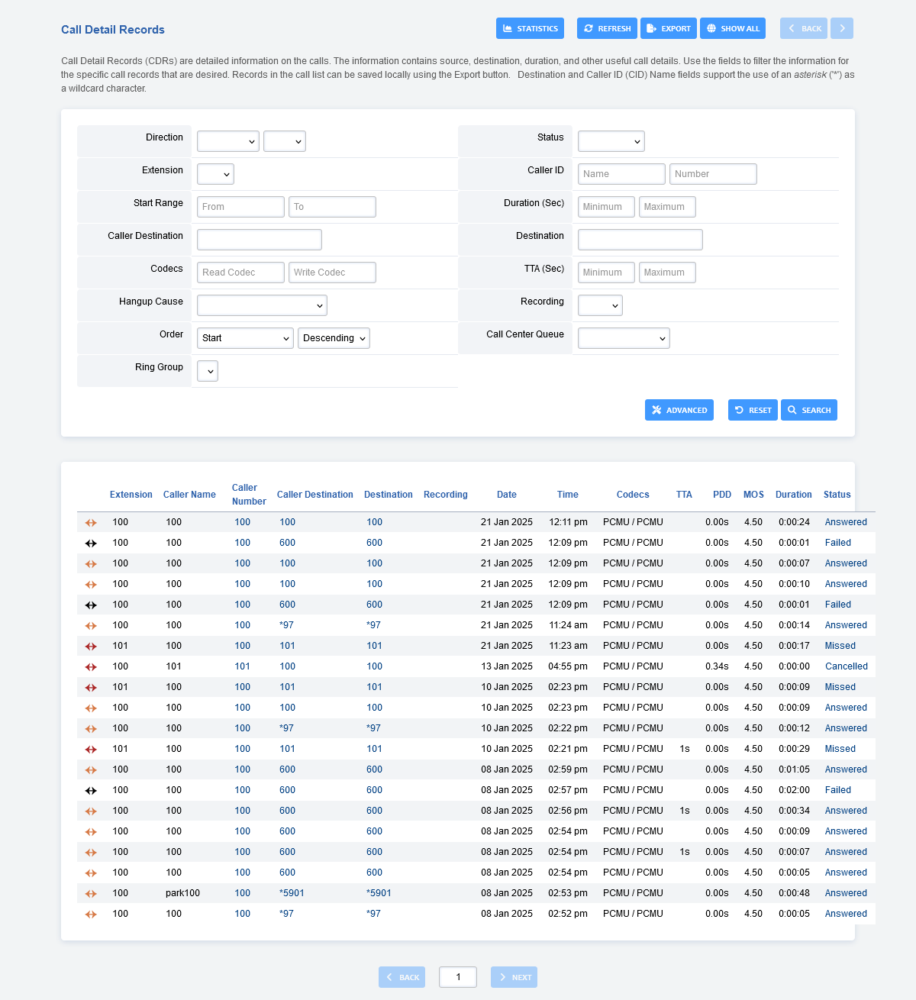

# Call Detail Records

Call Detail Records (CDRs) are detailed information on the calls. Use
the fields to filter the information for the specific call records that
are desired. Records in the call list can be saved locally using the
Export button.

-   **Extension** Phones extension
-   **Caller Name** Caller ID Name
-   **Caller Number** Where the call came from
-   **Caller Destination** Where the call went to
-   **Recording** A link will appear if the call recorded
-   **Date & Time** When the call entered the system
-   **Codecs** Phone codec
-   **TTA** Time To Answer the call
-   **PDD** Post Dial Delay
-   **MOS** Mean Opinion Score is a measure of voice call quality
-   **Duration** How long the call was
-   **Status** Details if call was Answered, Missed, No Answer,
    Voicemail, Busy, Cancelled or Failed

**Call Detail Records** are detailed information on the calls. The
information contains source, destination, duration, and other useful
call details. Use the fields to filter the information for the specific
call records that are desired. Then view the calls in the list or
download them as comma seperated file by using the **CSV** button.

Note that this page makes use of XML CDR for reporting.

## Post Dial Delay (PDD)

Post Dial Delay (PDD) is experienced by the sender as the time from the
sending of the final dialed digit to the point at which the sender hears
ring tone or other in-band information. In other words, the PDD would be
the time from when the sender sends the INVITE to receiving the first
ringing response.

That said, PDD does not take into account the time it takes the receiver
to hear the call coming in due to the various factors on how they are
setup for inbound calls. For example, call forwarding may affect the
time it takes the receiver to know that someone is calling because of
call forwarding. The sender might hear a ring tone almost instantly from
the time it dials the final digit because they sent out an INVITE, but
the receiver of the call might have setup inbound calls to be forwarded
to their cell phone, in which now the call must travel through their
phone system, to their phone system\'s gateway carrier to deliver the
sender\'s call to the receiver\'s cell phone carrier network in order
for the cell phone carrier to deliver the sender\'s call to the
receiver\'s cell phone.

## Recordings

Any calls which have the entry in the name column underlined (ie. the
name is a link) have a recording available. Clicking on the name will
playback the recording in a new window. In such cases the number entry
will also be a link - clicking on this link will download the recording
to your computer as a wav file.

## Possible issues

### No records showing up under Apps-Call Detail Records

Possible causes:

**1. The module is disabled**

-   Make sure the XML CDR module is enabled and running in the Menu -\>
    Advanced -\> Modules.

**2. Save to XML Files**

Save the CDR files to the file system and then use a cron job to load
them once a minute into the database.

Edit the **/etc/freeswitch/xml_cdr.conf.xml config** Easiest command
line file edito is called nano

> nano /etc/freeswitch/xml[cdr.conf.xml]{#cdr.conf.xml} config

Comment out this line by adding \<!\-- and \--\>. Make sure to do this
carefully.

> \<!\-- \<param name=\"url\"
> value=\"<http://127.0.0.1/app/xml_cdr/v_xml_cdr_import.php%22/>\>
> \--\>

Run this command one time to add the import command to crontab.

> (crontab -l; echo \"\* \* \* \* \* \$(which php)
> /var/www/fusionpbx/app/xml[cdr]{#cdr}/xml[cdr_import.php]{#cdr_import.php}
> 300\") \| crontab

Once you\'ve made these changes you can save the file. You could restart
your server, or you could reloadxml and then restart the xml[cdr]{#cdr}
module. Either is ok, it is up to you. Then your changes will have taken
effect and you should no longer lose your menu bar when looking at CDR
information.

> fs[cli]{#cli} -x \'reloadxml\'
>
> fs[cli]{#cli} -x \'reload mod[xml_cdr]{#xml_cdr}\'

## XML CDR configuration

For more detailed configuration go to the XML editor (Menu -\> Advanced
-\> XML Editor) and in autoload configs look at
xml[cdr.conf.xml]{#cdr.conf.xml}

:::: note
::: title
Note
:::

By default only the a-leg of the call is logged therefore if you make a
recording of the b-leg you won\'t be able to retrieve it using the Call
Detail Records. If you want the b-leg as well you need to change
log-b-leg=true in this config and in the default settings.
::::

## Harddrive space usage

:::: note
::: title
Note
:::
::::

Recordings also take up space and may be manually deleted if you want
the space back these are kept in (source install)
/usr/local/freeswitch/recordings/{Domian[Name]{#name}}/archive or
(package install) /var/lib/freeswitch/recordings/{Domain Name}/archive
and inside that by year, month and day.

## [CDR Default Settings](/en/latest/advanced/default_settings.html#id4)
