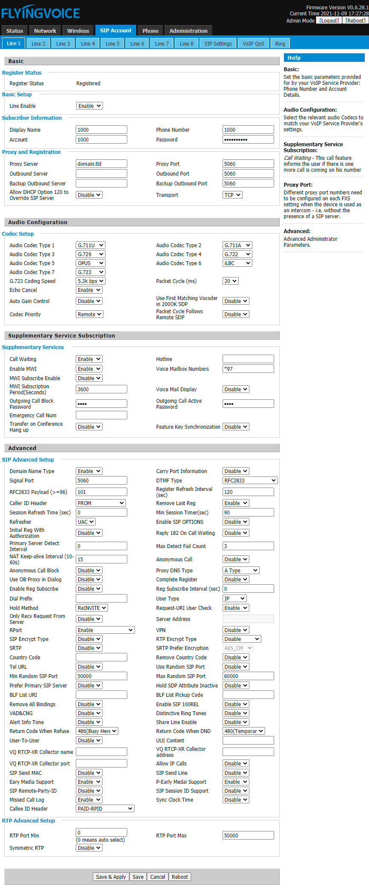

\######### Flyingvoice \#########

Setting up a **Flyingvoice** SIP phone through the phone\'s local http
management portal.

-   Once the phone powers up, press the **OK** button once or **Menu**
    \> **Status** and the phone will display its IP address on the
    screen. Navigate to that IP on another device in a web browser, and
    use **admin** for the username and **admin** for the password.

-   **Enter the following information for each Account that is
    required:**
-   Click the **SIP Account** tab at the top menu.
-   Click the **Line 1** tab at the top secondary menu.
-   Set **Line Enable** to enabled.
-   Set **Display Name** to the user\'s name or the extension number, or
    both, ie \"1000\".
-   Set **Account** to the users FusionPBX extension number, in this
    case 1000.
-   Set **Phone Number** to the users FusionPBX extension number, in
    this case 1000.
-   Set **Password** to the users FusionPBX password.
-   If you would like to use TCP transport, set **Trasport** to TCP.
-   Under **Proxy and Registration**, set the **Proxy Server** to your
    FusionPBX domain for that extension.
-   Set **Voice Mailbox Numbers** to \*97
-   Click **Save & Apply.**

