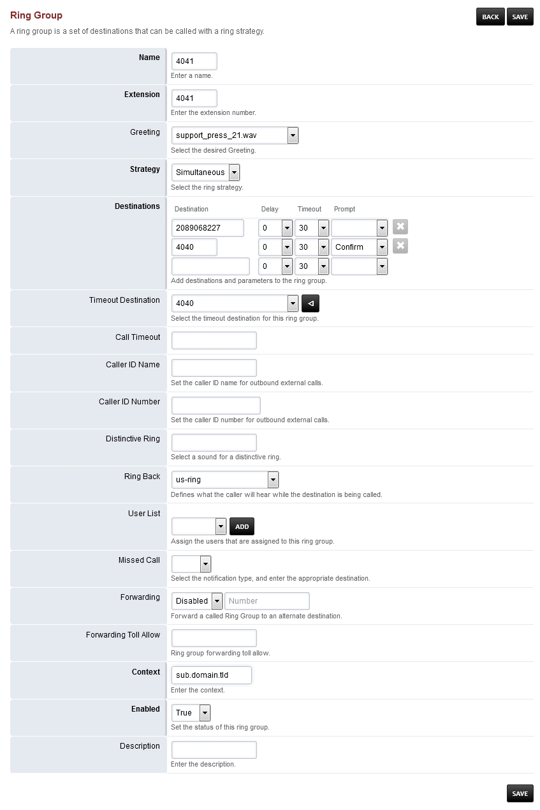
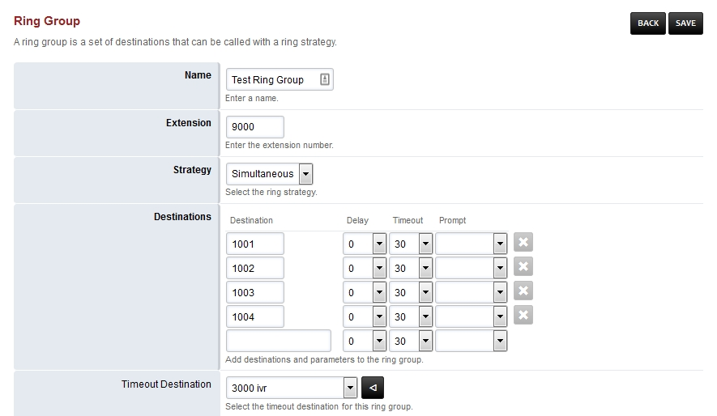

# Ring Groups

| 

A ring group is a set of destinations that can be called with a ring
strategy.

<iframe width="100%" height="350" src="https://www.youtube.com/embed/sULuuLOSvLQ?rel=0" frameborder="0" ; encrypted-media" allowfullscreen></iframe>

To add a ring group click the plus. [Click for the youtube
video](https://youtu.be/sULuuLOSvLQ) .

-   **Name** A meaningful name for this ring group. This name is used in
    th Destination select list.

-   **Extension** The extension number for this ring group.

-   **Greeting** Play a sound file upon calling the Ring Group
    extension.

-   **Strategy** The selectable way in which the destinations are being
    used.

    > -   **Simultaneous** Rings all destinations. All destination share
    >     the same thread.
    > -   **Sequence** Calls destinations in sequence where order that
    >     is lower goes first.
    > -   **Enterprise** Ring all destinations. Each destination uses
    >     its own thread.
    > -   **Rollover** Calls destinations in sequence and skips busy
    >     destinations.
    > -   **Random** A random destination will ring.

-   **Destinations** The destination numbers are the numbers for the
    ring group to call. Destinations can only be local registered
    endpoints or external numbers.

    > -   **Extensions** Local registered extensions.
    > -   **External numbers** Destinations out to an external number.

-   **Prompt** Where you determine if the call must have a dial to
    confirm before a pickup event.

-   **Caller ID Name Prefix** The string that is added to the caller ID
    when it displays on the ringing extension.

-   **Caller ID Number Prefix** The **Number** that is added to the
    caller ID when it displays on the ringing extension.

-   **Ring Back** What the caller hears when they are waiting for the
    **Destinations** to answer. (ex. Music on Hold, us-ring)

-   **Context** The context defaults to the domain name.

## Ring Group Example

In our example we will have 4 extensions all ring at the same time until
one of them pick up first. Click the + to create a ring group. Fill in
the fields that are in **bold**. In the Extension box type a number that
is **NOT** already created. This new extention won\'t be in the
extension list. The strategy will be Simultaneous. Enter in the
destination the 4 extensions 1001, 1002, 1003, 1004.

