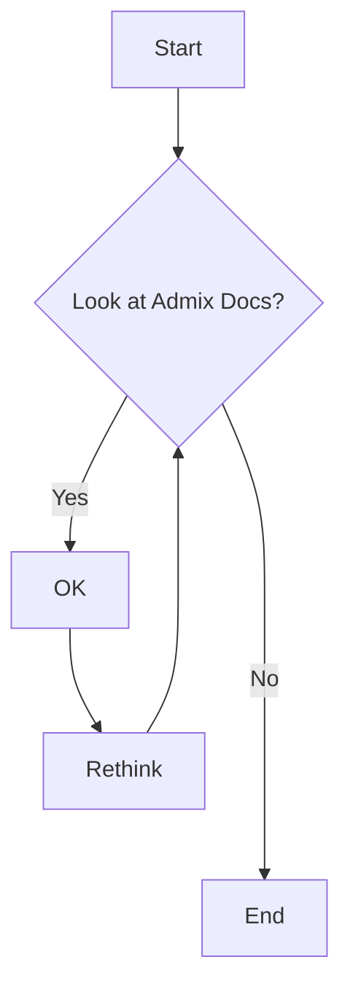

# Restore

It\'s always good to have a restore method of a backup in place. Here
are the steps to a basic restore method with FusionPBX.

:::{note}
It is important to know if your installation is from package or source
as the paths are different for FreeSWITCH. Always test the backups and
restore methods on test machines first.
:::

-   To create the script use an editor such as vi or nano.
-   Copy/Paste from the code block below and save the file as
    fusionpbx-restore.sh
-   Replace zzz with your database password
-   chmod + x fusionpbx-restore.sh and then run the script
    ./fusionpbx-restore.sh
-   edit the script as needed and run this script from the server you
    are restoring on.

```{=html}
<!-- -->
```
    #!/bin/sh
    now=$(date +%Y-%m-%d)
    ssh_server=x.x.x.x
    database_host=127.0.0.1
    database_port=5432
    export PGPASSWORD="zzz"

    #run the remote backup
    ssh -p 22 root@$ssh_server "nice -n -20 /etc/cron.daily/./fusionpbx-backup.sh"

    #delete freeswitch logs older 7 days
    find /var/log/freeswitch/freeswitch.log.* -mtime +7 -exec rm {} \;

    #synchronize the backup directory
    #rsync -avz -e 'ssh -p 22' root@$ssh_server:/var/backups/fusionpbx /var/backups
    rsync -avz -e 'ssh -p 22' root@$ssh_server:/var/backups/fusionpbx/postgresql /var/backups/fusionpbx
    rsync -avz -e 'ssh -p 22' root@$ssh_server:/var/www/fusionpbx /var/www
    rsync -avz -e 'ssh -p 22' root@$ssh_server:/etc/fusionpbx /etc
    find /var/backups/fusionpbx/postgresql -mtime +2 -exec rm {} \;

    rsync -avz -e 'ssh -p 22' root@$ssh_server:/etc/freeswitch/ /etc
    rsync -avz -e 'ssh -p 22' root@$ssh_server:/var/lib/freeswitch/storage /var/lib/freeswitch
    rsync -avz -e 'ssh -p 22' root@$ssh_server:/var/lib/freeswitch/recordings /var/lib/freeswitch
    rsync -avz -e 'ssh -p 22' root@$ssh_server:/usr/share/freeswitch/scripts /usr/share/freeswitch
    rsync -avz -e 'ssh -p 22' root@$ssh_server:/usr/share/freeswitch/sounds /usr/share/freeswitch

    echo "Restoring the Backup"
    #extract the backup from the tgz file
    #tar -xvpzf /var/backups/fusionpbx/backup_$now.tgz -C /

    #remove the old database
    psql --host=$database_host --port=$database_port  --username=fusionpbx -c 'drop schema public cascade;'
    psql --host=$database_host --port=$database_port  --username=fusionpbx -c 'create schema public;'
    #restore the database
    pg_restore -v -Fc --host=$database_host --port=$database_port --dbname=fusionpbx --username=fusionpbx /var/backups/fusionpbx/postgresql/fusionpbx_pgsql_$now.sql

    #restart freeswitch
    service freeswitch restart
    echo "Restore Complete";


# Admix Test Docs

These are test docs

```
python if x == 1: print("x is 1.") 
```


<style> @keyframes heart { 0%, 40%, 80%, 100% { transform: scale(1); } 20%, 60% { transform: scale(1.15); } } .heart { animation: heart 1000ms infinite; color: red; font-size: 2em; } </style> :octicons-heart-fill-24:{ .heart } :octicons-heart-fill-24:{ .heart } :octicons-heart-fill-24:{ .heart }

!!! note
    In Python we use indentation instead of curly braces:
    ```python
    i = 1
    while i < 6:
        print(i)
        if i == 3:
            break
        i += 1
    ```
    If indentation is wrong, the python code will fail to execute


| **Substance** | **Description**          |
| ------------- | ------------------------ |
| **Table1**    | This is data for table 1 |
| **Table2**    | This is data for table 2 |
| **Table3**    | This is data for table 3 |





:fontawesome-brands-medium: :fontawesome-brands-facebook: :fontawesome-solid-book-open: :fontawesome-regular-snowflake: :material-google-maps: :material-guy-fawkes-mask: :fontawesome-brands-youtube-square: :material-check-circle: :material-arrow-right: :fontawesome-solid-user: :fontawesome-solid-paper-plane: :fontawesome-solid-ship:

:fontawesome-brands-firefox:{style="color: orange; font-size: 40px;"} 


++enter++   ++tab++   ++space++   ++arrow-up++  ++arrow-down++   ++page-up++    ++home++    ++backspace++    ++insert++

++alt++     ++right-alt++   ++left-command++    ++right-control++   ++fn++  ++shift++   ++left-shift++

++pipe++   ++backslash++    ++bar++     ++semicolon++   ++tilde++   ++underscore++

++brace-left++      ++brace-right++     ++bracket-left++    ++bracket-right++   ++double-quote++    ++single-quote++ 

++exclam++  ++comma++   ++equal++   ++less++    ++greater++   ++minus++

++1++   ++f9++   ++q++  ++num0++    ++num1++    ++num-lock++

++ctrl+alt+delete++

