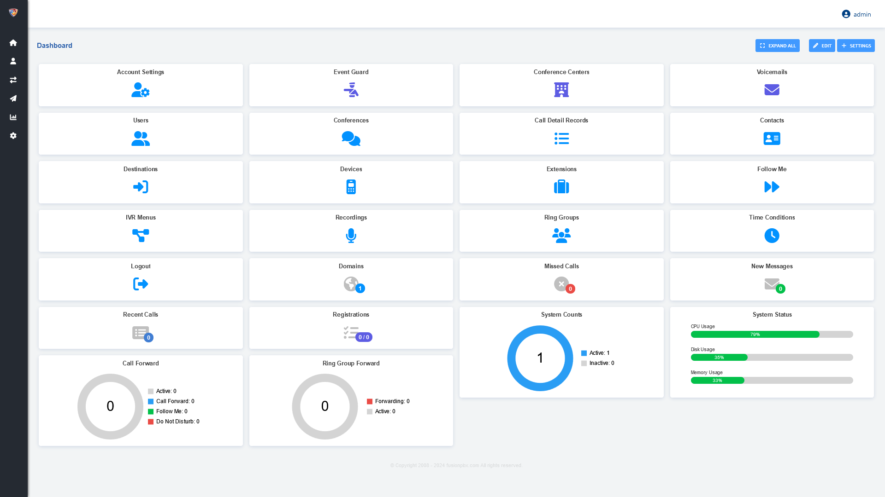

# Dashboard

Quickly access information and tools related to your account. Depending
on the user permissions, the user may see fewer options on this screen.

-   **Voicemail:** New and total voicemails related to the user\'s
    voicemail box. A user can be assigned to more than 1 voicemail box.
-   **Missed Calls:** Missed calls for the user.
-   **Recent Calls:** Number of calls in the last 24 hours.
-   **System Status:** Disk usage in percentage, FusionPBX version,
    FreeSWITCH version, FreeSWITCH uptime, OS Uptime, CPU Usage, DB
    Connections, Channels and Registrations.
-   **Call Routing:** See if call forward, follow me, do not disturb is
    set and a quick way to edit those options if needed.
-   **Ring Group Forward:** See the name, extension number, if
    forwarding is enabled, and what number it is forwarded to.
-   **System Counts:** Number of Domains, Devices, Extensions, Gateways,
    Users, Destinations, CC Queues, IVR Menus, Ring Groups, Voicemail
    and if they are disabled.

## [Dashboard Default Settings](/en/latest/advanced/default_settings.html#id5)

\*\*\*\*\*\*\*\*\*\*\*\*\*\*\*\*\*\*\*\*\*\*\*\*\*\*\*\*\*\*\*\*\*\*\*\*\*\*\*\*\*\*\*\*\*\*\*\*
How to Move the FusionPBX v5.3 Menu Bar to the Top
\*\*\*\*\*\*\*\*\*\*\*\*\*\*\*\*\*\*\*\*\*\*\*\*\*\*\*\*\*\*\*\*\*\*\*\*\*\*\*\*\*\*\*\*\*\*\*\*

### Overview

The new version of FusionPBX has the menu bar on the left side of the
screen by default. Personally, I prefer it at the top, so here are the
steps I used to make that change:

#### Step-by-step

1.  **Log in to the FusionPBX Admin Interface**
    -   Access the FusionPBX administrative interface.
2.  **Go to Advanced \> Default Settings**
    -   Navigate to **Advanced** \> **Default Settings**.
3.  **Search for \"Theme\"**
    -   In the filter at the top, search for \"Theme.\"
4.  **Change Menu Style to Fixed**
    -   Find the **Menu_Style** setting and change it to **Fixed**.
5.  **Save and Reload**
    -   Save your changes and click **Reload** at the top of the Default
        Settings screen.
6.  **Refresh the Interface**
    -   Refresh your FusionPBX interface, and the menu bar should now be
        at the top.
